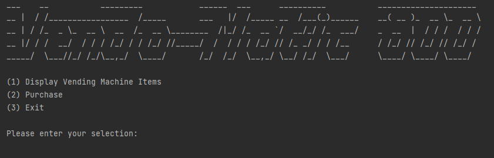
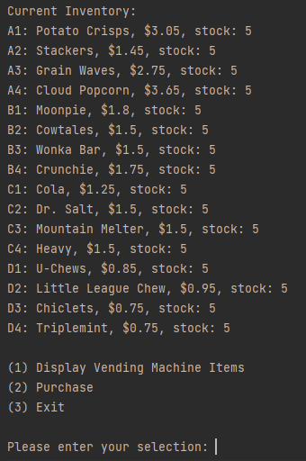
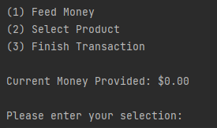
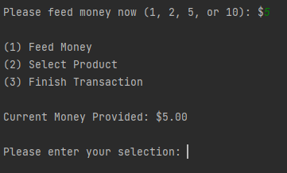
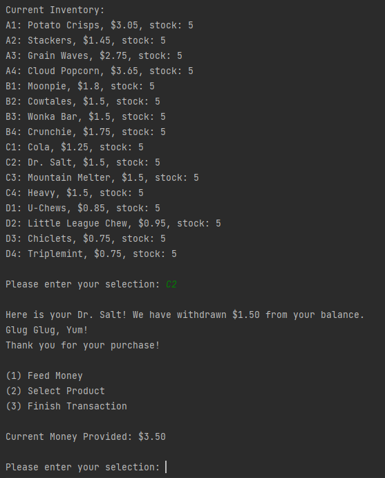
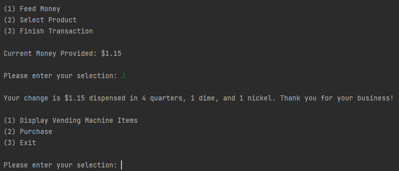
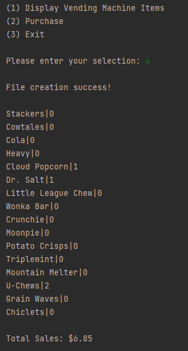

# Vendo-Matic 800

This is a Command Line Interface vending machine emulator designed to meet given specifications.
I was teamed with a partner at a coding boot camp and we were given four days to complete the project.

## Walkthrough

This is the main menu. The user can input the number of their choice using the keyboard. All input is validated 
throughout the application and appropriate error messages are relayed to the user if necessary. On startup, the program 
reads the provided CSV file to populate the inventory with five of each item. The sales report, which keeps a lifetime 
count of sales for each item along with the total amount of money made, is also pulled into memory from a persistent 
file (and if the file doesn't exist, a new report is created with 0 sales for the items in the CSV file). Any new items 
in the CSV file that weren't present in the (possibly) existing sales report are added at 0 sales.

---

Selection 1:

---
Selection 2:

---
Selection 1 (and entering 5 - the money provided is updated):

---

Selection 2 (purchasing the item at slot C2 - purchase price is charged, user money remaining is updated, inventory is 
updated, and Sales Report is updated):

---

When the user is finished, selection 3 dispenses change in the fewest possible quarters, dimes, and nickels:

---

Back at the main menu, the secret Sales Report can be accessed in the unlisted option 4. This option creates a new sales
report file with a unique name using the date and time in the (newly created, if necessary) sales_reports directory and 
displays the sales report for the user. A persistent total is kept by saving a backup file of the Sales Report when the 
program is ended by selection 3 in the main menu.

---

## Design/Technical Details

The design of the vending machine was provided as a set of specifications for this project which are not included here
to prevent possible searches and copying by future students (This is also why the name of the boot camp is not 
mentioned).

To begin the project, my partner and I combed through the specifications and laid out a plan to keep the code loosely
coupled so that it could be easily modified in the future. We set to achieve this by creating different classes for file
reading and writing, money math, printing to the terminal, and accepting user input.

For efficiency, the program does file reading and writing only when necessary - read at startup, write on exit, and 
write when the Sales Report option is selected, as required by the specifications. The CSV and persistent Sales Report
files are read and saved into memory on startup using methods in the FileIO class so that the data can be efficiently 
used by methods in the Inventory and SalesReport classes. The buildInventory method creates Chip, Drink, Candy, and Gum 
objects using the data and stores them in Lists (five each at startup) as values in a map with a 
String of the slot number as keys. The list size is updated on each sale of an item in a slot, as is the sale count for
each item and running total of all sales in the Sales Report.

Input validation is achieved by simple if/else logic that matches an expected input with a function or prints an error
if the input does not match any expected values. This logic is placed inside a loop so that the user is instantly 
redirected to the last menu. Invalid input during Feed Money returns the user to the Purchase menu.

## Final Thoughts

While working on this project, my partner and I both had some ideas that we would have liked to implement given more
than four days to work on it. We might have asked the user if they would like to try again after an invalid input
for Feed Money instead of automatically directing them back to the menu. We might have prompted the user for a password
to save and view the Sales Report, since that seems like something a maintenance person or administrator would do. I
would have liked to make a more fancy startup splash screen.

While we created classes to separate the logic from inputs, outputs, and file reading, I feel we could have done better
to decouple the Printer class. For example, the Printer class essentially just mirrors System.out methods instead of
interpreting types of output (menu, error, prompt, etc). Adjusting it to take more general information would make it
easier to modify to output for a GUI or webpage. In addition, interfaces could have been created for file
reading/writing and user input/output to further abstract the functionality.

In all I am happy with the result of this capstone project. It's a simple application, but it works! And it was great
fun to make :)
